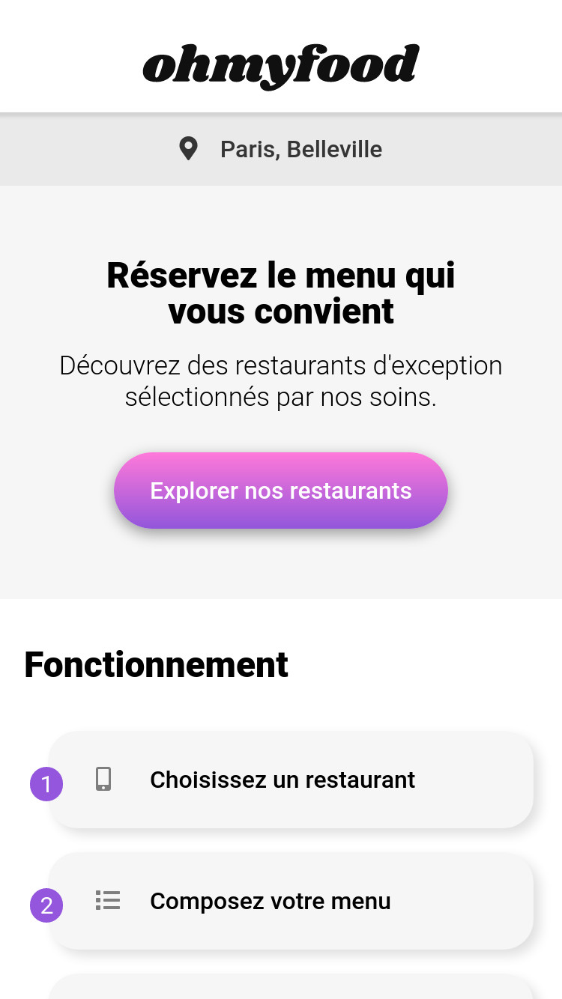
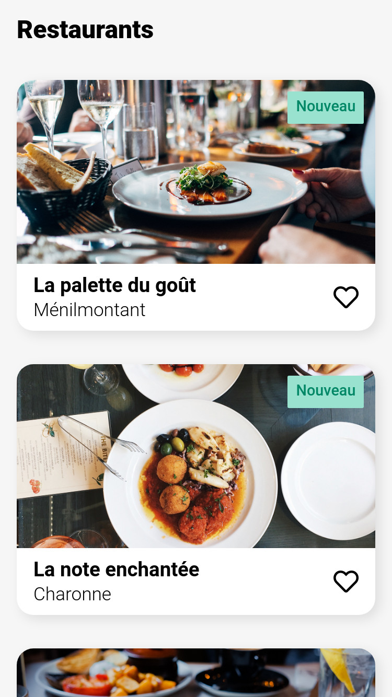
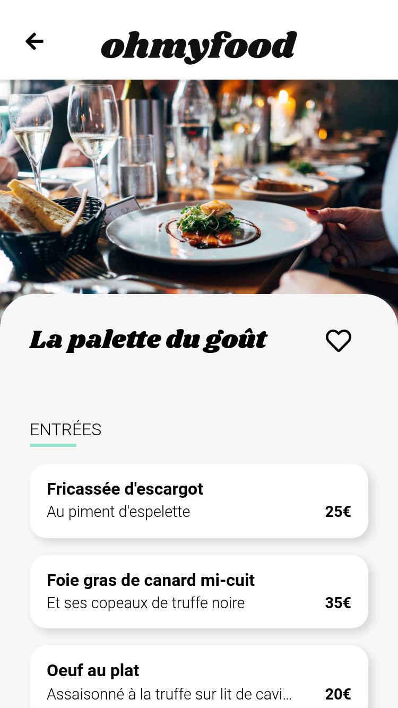

<h1 align="center">
    <br>
    <a href="https://stevancorre.github.io/oh-my-food/">
        
    </a>
    <br>
</h1>

<h4 align="center">This project is an <a href="https://openclassrooms.com">OpenClassrooms</a> assignment.</h4>

<p align="center">
    <a href="https://nodejs.dev">
        
    </a>
    <a href="https://www.w3.org/html/">
        
    </a>
    <a href="https://nodejs.dev">
        
    </a>
    <a href="https://paypal.me/aiixu">
        
    </a>
</p>

<p align="center">
    <a href="https://stevancorre.github.io/oh-my-food">Online</a> •
    <a href="#preview">Preview</a> •
    <a href="#build-and-run">Build and run</a> •
    <a href="#license">License</a>
</p>

<br>

## Preview

<p float="left" align="middle">
  
   
  
</p>

<br>

## Build and Run

###  📥 Install dependencies

```console
$ npm i
```

### 🏗️ Build and run

```console
# watch scss
$ npm run scss:watch

# start
$ npm run start

# build
$ npm run build
```

<br>

## License

This project is <a href="https://opensource.org/licenses/MIT">MIT</a> licensed.
